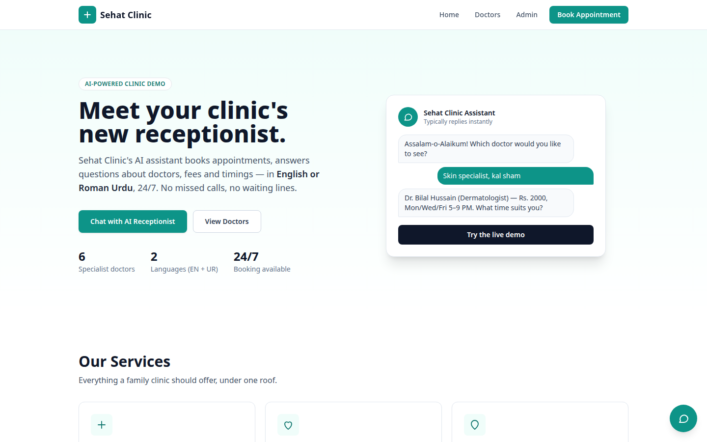
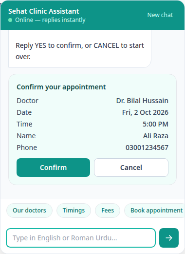
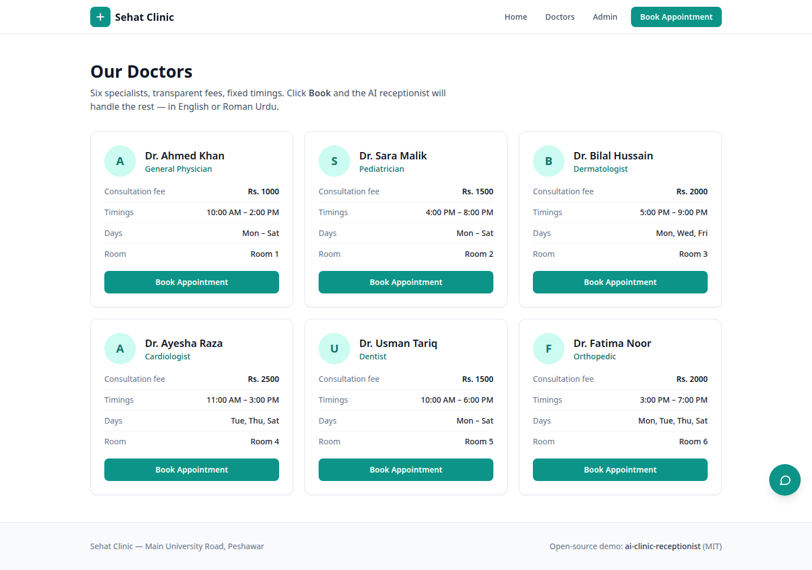
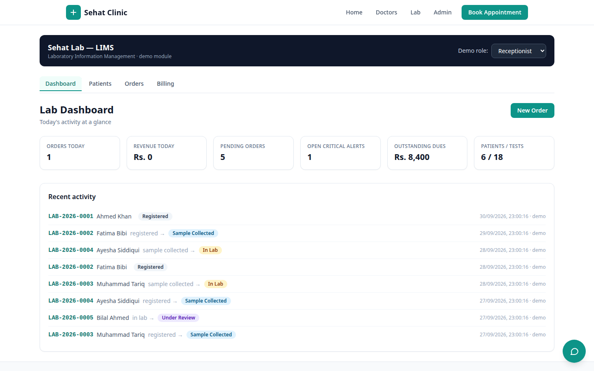
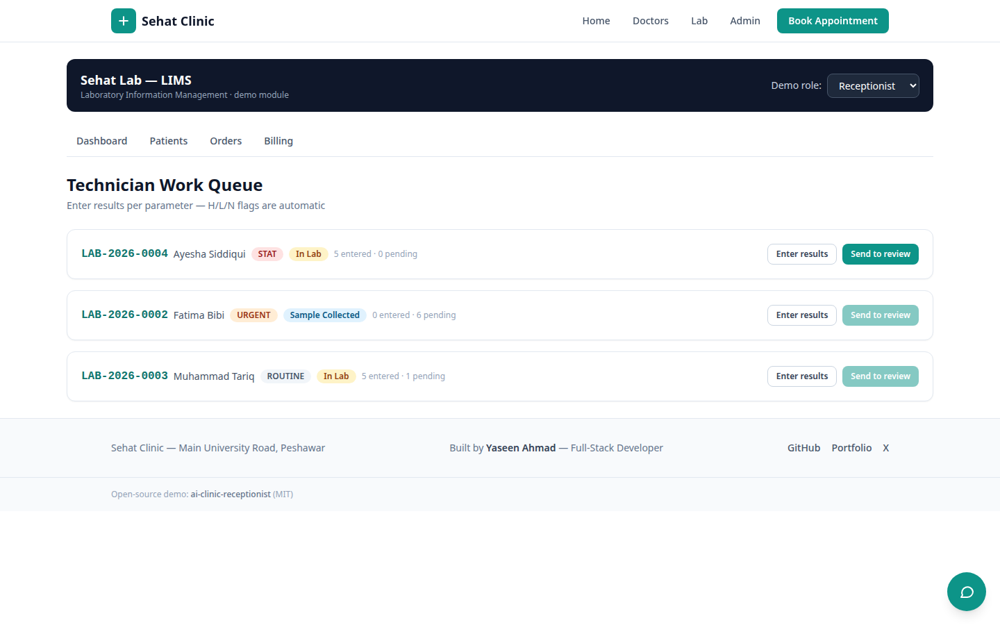
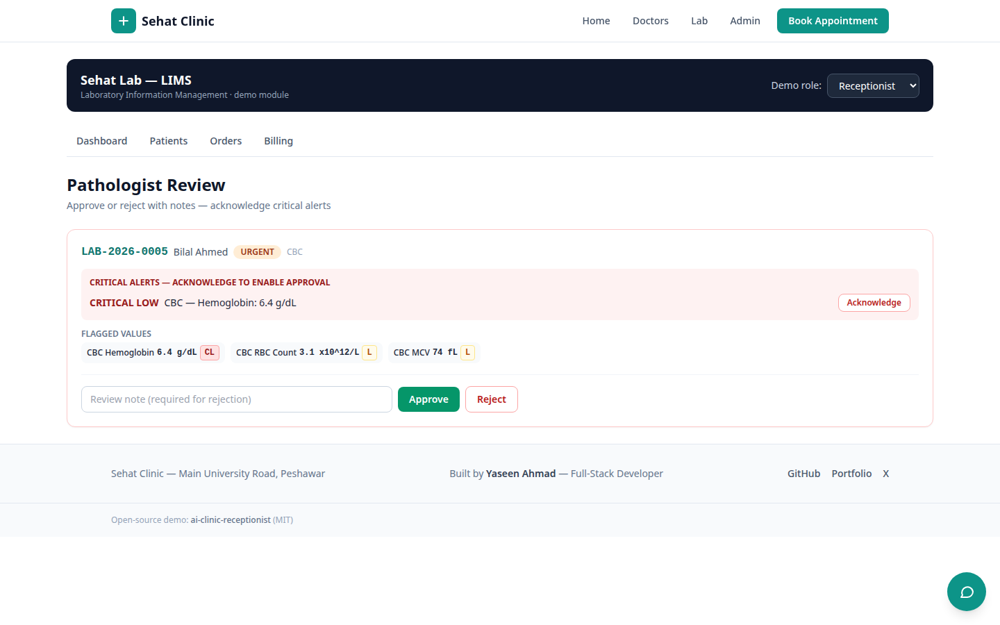

# AI Clinic Receptionist

[](https://nextjs.org/)
[](https://www.typescriptlang.org/)
[](https://tailwindcss.com/)
[](https://groq.com/)
[](LICENSE)

**An open-source AI receptionist for clinics.** A bilingual (English + Roman Urdu) chatbot that answers questions about doctors, fees and timings — and books appointments conversationally, 24/7. No phone calls, no missed patients.

Built as a working demo for **Sehat Clinic** (fictional). Swap in your own clinic's data and deploy.

## Live Demo

**https://ai-clinic-receptionist-gold.vercel.app** — try the AI chat (English + Roman Urdu), book an appointment or a lab test, and explore the full Lab (LIMS) module.

---

## The Problem

Small clinics lose patients every day because:

- The receptionist misses calls during busy hours — the patient calls the *next* clinic instead
- Booking means a phone call during working hours only
- Many patients are more comfortable in **Roman Urdu** than English — most booking systems ignore them

## The Solution

A floating AI chat widget on the clinic website that:

1. Greets patients in English **or** Roman Urdu (auto-detected)
2. Answers: doctors list, per-doctor fees, timings, days, location
3. Books appointments slot-by-slot — doctor, date, time, name, phone — then shows a confirmation with a **booking ID**
4. Feeds every booking into a simple **admin dashboard**

Zero config to try: the default `mock` AI engine is rule-based and works fully offline. Flip one env var for a real LLM (Groq).

---

## Screenshots

### Landing page


### AI chat — booking a visit in Roman Urdu + English


### Doctors page


### Lab (LIMS) — dashboard


### Lab (LIMS) — technician work queue


### Lab (LIMS) — pathologist review


---

## Features

- Floating AI chat widget on every page (English + Roman Urdu, auto-detected)
- Conversational appointment booking: doctor → date → time → name → phone → confirm
- Conversational **lab test booking**: tests → sample date → name → phone → confirm (creates a real `/lab` order)
- Confirmation card + unique booking ID (`SC-XXXX-XXXX`)
- 6 demo doctors with specialties, PKR fees, timings, working days
- `/doctors` page with per-doctor "Book" buttons that pre-fill the chat
- `/admin` dashboard: login, booking stats, booking list, cancel action
- **Two AI modes**: `mock` (rule-based, offline, zero config) and `groq` (llama-3.3-70b-versatile)
- Bookings persisted to `data/bookings.json` (gitignored); in-memory fallback
- Clean, white, professional UI — no external database needed for the demo
- Deploys to Vercel with zero config

### Lab Module (LIMS) — at `/lab`

A full Laboratory Information Management System reimagined from the Python/FastAPI
[LIMS.Pro](https://github.com/MrYaseen0/lims-pro) project, built natively in Next.js + TypeScript:

- **Patient registry** — serial numbers (`0001-09-2026`), search, detail + order history
- **Test catalog** — 18 tests across 6 categories with reference ranges, PKR prices, critical thresholds
- **Orders** — `LAB-2026-0001` numbering, priorities, full workflow state machine enforced server-side:
  `registered → sample_collected → in_lab → under_review → approved → report_released`
  (reject sends an order back to the lab)
- **Result entry** — per-parameter entry with automatic H/L/N flags; critical values raise
  **critical alerts** (CL/CH) and block approval until acknowledged
- **PDF lab reports** — real downloadable PDFs (pdf-lib): patient/order header, flagged results table,
  red critical highlights, barcode, pathologist note
- **Billing** — invoices, PKR payments (cash/card/bank/online), balance tracking
- **Analytics** — 14-day revenue chart, category volumes, top tests (pure SVG, no chart deps)
- **Inventory** — reagents/consumables with lot numbers, expiry alerts, low-stock alerts
- **QC** — Levey–Jennings charts with simplified Westgard rules (1_3s, 2_2s, R_4s)
- **Demo roles** — Admin, Manager, Receptionist, Technician, Pathologist (UI-level role switcher)
- **Chat lab booking** — patients can book lab tests conversationally in the AI chat:
  *"mujhe CBC test karwana hai"* → the chat collects tests, sample date, name, phone and creates
  a real lab order (`source: "chat"`)

Demo data seeds automatically on the first lab API call (or `POST /api/lab/seed`).

---

## Quickstart

```bash
git clone https://github.com/<your-username>/ai-clinic-receptionist.git
cd ai-clinic-receptionist
npm install
```

```bash
npm run dev
```

Open [http://localhost:3000](http://localhost:3000) — click the chat bubble (bottom-right) and try:

- `I want to book Dr Sara tomorrow`
- `skin specialist ki fees kya hai?`
- `kal sham 5 baje`

Admin panel: [http://localhost:3000/admin](http://localhost:3000/admin) — password `demo123` in local dev (set `ADMIN_PASSWORD`; required on production).

That's it. No API keys needed — the mock engine runs offline.

---

## How it works

```
Patient message
      │
      ▼
/api/chat ──► lib/ai.ts ──► AI_MODE=mock ? rule-based bilingual engine
      │                      AI_MODE=groq ? Groq (llama-3.3-70b-versatile, JSON mode)
      │                                   slots: doctor/date/time/name/phone
      ▼
 bookingReady → Confirm card → /api/book → booking ID
      │
      ▼
/api/bookings (admin, password-gated) → dashboard table
```

**Slot filling (mock mode):** the engine extracts phone numbers (`0300-1234567`), names (`my name is Ali` / `mera naam Ali`), doctors (by name *or* specialty keywords like `dant`, `dil`, `skin`), dates (`tomorrow`, `kal`, `jumma`, `05-10`), and times (`5pm`, `sham 5`, `11 baje`) — then asks for whatever is still missing.

**Groq mode:** the same slot schema is enforced through a JSON-mode system prompt, so switching engines never breaks the booking flow.

---

## Tech stack

| Layer | Choice |
|---|---|
| Framework | Next.js 14 (App Router) |
| Language | TypeScript (strict) |
| Styling | Tailwind CSS |
| AI (optional) | Groq — `llama-3.3-70b-versatile` |
| Storage (demo) | In-memory + `data/bookings.json` |
| Deploy | Vercel |

## Environment variables

Copy `.env.example` to `.env.local`:

| Variable | Required | Default | Description |
|---|---|---|---|
| `AI_MODE` | No | `mock` | `mock` = rule-based offline engine, `groq` = real LLM |
| `GROQ_API_KEY` | Only for `groq` | — | Free key from [console.groq.com](https://console.groq.com) |
| `ADMIN_PASSWORD` | **Yes, on production** | `demo123` (dev only) | Password for `/admin`. **Set this on every public deploy** — in production with no `ADMIN_PASSWORD`, the admin panel and API fail closed (503 "Admin not configured"). |

## Project structure

```
ai-clinic-receptionist/
├── app/
│   ├── page.tsx            # Landing page (hero, services, doctors preview)
│   ├── doctors/page.tsx    # All 6 doctors, fees, timings
│   ├── admin/              # Admin login + bookings dashboard
│   └── api/
│       ├── chat/route.ts   # POST {messages, slots} → {reply, slots, bookingReady}
│       ├── book/route.ts   # POST → creates booking, returns booking ID
│       └── bookings/route.ts # POST {password} → list / cancel bookings
├── components/
│   └── ChatWidget.tsx      # Floating bilingual chat widget + confirm card
├── lib/
│   ├── ai.ts               # Mock engine + Groq engine, slot extraction
│   ├── doctors.ts          # Demo clinic + doctor data
│   └── bookings.ts         # In-memory store + JSON persistence
├── docs/screenshots/       # README screenshots
└── data/                   # bookings.json lives here (gitignored)
```

## Deploy on Vercel

1. Push to GitHub
2. Import the repo in Vercel — no build config needed (`next build` just works)
3. Set env vars: `ADMIN_PASSWORD` (**required** — admin fails closed without it), optional `AI_MODE=groq` + `GROQ_API_KEY`

## Roadmap

- [x] **Lab module (LIMS)** — patients, test catalog, orders, results, critical alerts, PDF reports, billing, analytics, inventory, QC + chat lab booking
- [ ] **WhatsApp integration** — book via WhatsApp Business API (most patients live there)
- [ ] **Urdu voice** — speech-to-text / text-to-speech so patients can *talk* to the receptionist
- [ ] **Supabase backend** — replace JSON storage with Postgres + realtime admin dashboard
- [ ] **SMS reminders** — appointment reminders via SMS
- [ ] **Multi-clinic / multi-branch** support
- [ ] **Urdu script (اردو)** UI option alongside Roman Urdu

## Contributing

Pull requests are welcome — especially:

- More languages / better Roman Urdu understanding in `lib/ai.ts`
- WhatsApp + voice prototypes (see roadmap)
- UI polish (keep it clean and professional)

1. Fork the repo
2. `git checkout -b feature/your-idea`
3. `npm run build` must pass
4. Open a PR

---

## Star this repo

If this saves your clinic from missed calls — or gives you a starting point for your own AI receptionist — **please star it**. It takes 2 seconds and helps other clinics find it.

Built with Next.js, TypeScript and Tailwind. Licensed [MIT](LICENSE).

---

## Built by

**Yaseen Ahmad** — Full-Stack Developer (Next.js, TypeScript, AI) based in Peshawar, Pakistan. Available for freelance: https://yaseenahmadexe.vercel.app

- GitHub: https://github.com/MrYaseen0
- Portfolio: https://yaseenahmadexe.vercel.app
- X: https://x.com/yaseencecosian
